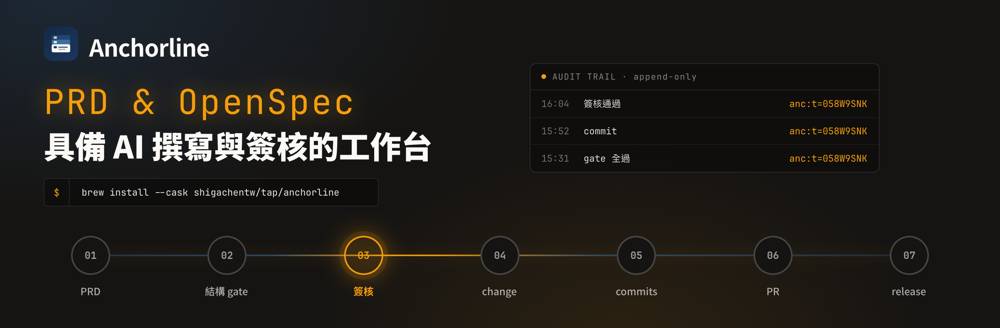
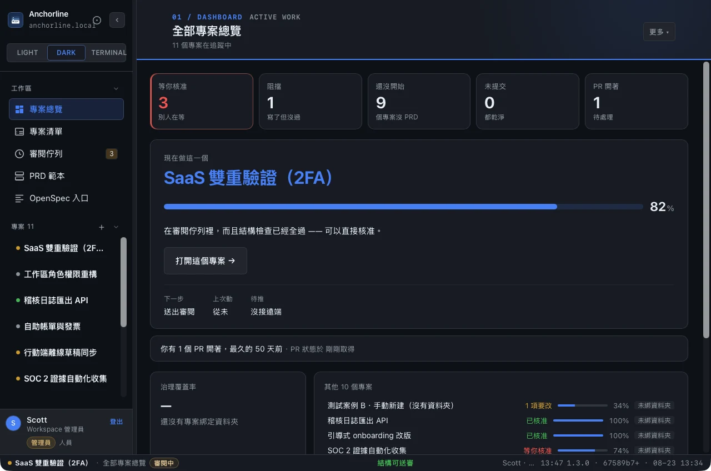

<p align="center">
  
</p>

# Anchorline

**本機優先的開發專案工作台 · A local-first workbench for AI-assisted development projects.**

一條治理鏈，加一份落在磁碟上的稽核軌跡。
One governance chain, plus an audit trail that lives on your disk.

[**繁體中文**](#繁體中文) · [**English**](#english) · [專案介紹頁 / Landing page](https://shigachentw.github.io/anchorline/landing-aid.html)

> ⚠️ **早期階段 / Early stage.** 目前產物**未簽章**，macOS 會被 Gatekeeper 擋、
> Windows 會被 SmartScreen 擋。Builds are **unsigned** — Gatekeeper and SmartScreen
> will block them. Signing and notarization are not done yet (see `docs/SCOPE.md` W4).

---

# 繁體中文

## 它是什麼

缺的從來不是一個資料庫，是一把 join key。`plans/*.md` 的 checkbox、git commit、
簽核、openspec change 各有各的身分，對不起來就只能各自顯示。Anchorline 給每個
工作單元一個穩定錨點（`<!-- anc:t=XXXXXXXX -->`），四份資料才串得成一條線。

```
PRD 撰寫 → 結構 gate → 簽核 → openspec change → commits → PR → release
```

市面上的 AI 開發工作台都在解「怎麼讓 agent 跑得更多」。這個解另一件事：
**怎麼證明這些 agent 做的事是被治理過的。**

> 前身為 SpecForge / PM-SPEC+SCVB。舊的 `sf:` 錨點仍可讀取。

## 它解決什麼

一個開發專案工作台要回答四個問題。多數工具答得出前兩個：

| | 問題 | 這裡怎麼答 |
|---|---|---|
| Q1 | 下一步做什麼？ | 焦點卡 · openspec 的第一個 `ready` artifact |
| Q2 | 現在到哪了？ | plan checkbox × openspec artifact 的加權 rollup |
| Q3 | **為什麼變成這樣？** | 決策紀錄（讀 ISA 的 `Decisions` / `Changelog`） |
| Q4 | **實際發生了什麼？** | append-only 稽核軌跡 |

Q3 與 Q4 是差異化所在。2026 年 ADR 復甦的理由很直白：**AI agent 現在寫掉大部分
程式碼，而看不到「為什麼」的 agent 會很開心地把理由重構掉。**

### 一個市面上沒有的機制

`authorAgentFamily` — **同一個 agent 族系撰寫的文件，不能由同族系核准。**

GitHub 的 CODEOWNERS 與 branch protection 只認人，不認 AI 族系，抓不到這一類。
治理鏈 replay 會把違規標出來——一條沒有標示違規的治理鏈沒有說服力。

治理覆蓋率的基準線取**第一筆帶錨點的事件**，不是全部歷史。既有專案有幾百個
沒有錨點的 commit，全算進去卡片會顯示「未治理 487」，而那個數字不可行動——
一張沒人看的卡片比沒有卡片更糟，因為它佔著版面。理由寫在 `src/lib/governance.ts` 檔頭。

## 主要畫面

| 畫面 | 回答 |
|---|---|
| **專案總覽** | 焦點卡（下一步／進度／上次動／待推）+ 跨 repo PR 雷達 + UAT 待測卡 |
| **編輯台** | PRD 引導撰寫 + 結構 gate + Markdown 即時預覽 |
| **審閱 / 簽核** | 簽核關卡，gate 未過擋核准 |
| **Task Tracking** | `plans/*.md` 進度、可直接勾選、右欄稽核軌跡三層 |
| **UAT 使用者測試** | 實機測試題逐題勾選，失敗與不測必填說明，結果寫回同一份 markdown |
| **OpenSpec 工作區** | change 清單與狀態，全部來自官方 CLI 的 `--json` |
| **檔案歷史** | 草稿快照與版本比對 |
| **發布** | release 追蹤 |
| **Agents** | Agent 角色、prompt、進場作業 |

<p align="center">
  
  <br><sub>專案總覽——焦點卡回答「下一步」，右側是跨 repo 的 PR 雷達</sub>
</p>

設計上有一條貫穿的取捨：**一次只指一個。** 焦點卡欄位硬性封頂 4 個，
其餘專案摺疊；稽核軌跡預設停在「回到工作」三行，完整時間軸要點兩下才到。
理由寫在 `src/lib/focus-card.ts` 與 `src/lib/log-views.ts` 的檔頭。

## 安裝

### macOS — Homebrew

```bash
brew install --cask shigachentw/tap/anchorline
```

⚠️ **產物未簽章**，所以第一次開會被 Gatekeeper 擋（Homebrew 預設會蓋
quarantine 屬性）。裝完跑一次：

```bash
xattr -dr com.apple.quarantine "/Applications/Anchorline.app"
```

或在 Finder 對 `Anchorline.app` 按住 Control 點一下，選「打開」。

更新與移除：

```bash
brew upgrade --cask anchorline
brew uninstall --cask anchorline
```

### 直接下載

[Releases](https://github.com/ShiGaChenTW/anchorline/releases) 有 macOS
（universal `.dmg`）、Windows、Linux 的產物。Gatekeeper／SmartScreen 的處理同上。

### 自行建置

```bash
git clone https://github.com/ShiGaChenTW/anchorline.git
cd anchorline
bun install
bun run tauri build          # 產物在 src-tauri/target/release/bundle/
```

### 需求

| | 版本 | 必要性 |
|---|---|---|
| [Bun](https://bun.sh) | ≥ 1.3 | 必要 |
| [Rust](https://rustup.rs) | ≥ 1.77 | 必要 |
| `git` | 任意 | 必要（沒有它就沒有專案統計） |
| [`openspec`](https://github.com/Fission-AI/OpenSpec) | ≥ 1.6 | 選用 · `npm i -g @fission-ai/openspec` |
| [`gh`](https://cli.github.com) | 任意 | 選用 · PR 雷達要用 |

**選用的 CLI 找不到時不會報錯**，畫面會顯示一行安裝提示。App 會依序找：
你在設定裡指定的路徑 → `PATH` → 三平台常見安裝點。找不到就在設定裡填絕對路徑——
任何猜路徑的邏輯都會漏掉某個人的環境。

平台：macOS · Windows · Linux（CI 三平台都建置，但目前只有 macOS 有實機驗證）。

## 開發

```bash
bun run dev            # 只跑前端（vite）
bun run tauri dev      # 完整 App
bun run typecheck
bun test               # 1506 tests / 77 files
cd src-tauri && cargo test    # 契約測試
```

```bash
bun run track          # 終端 TUI：plans/ 進度，j/k 切換，i 補鑄錨點
bun run track:frame    # 印一張完整畫面就結束（截圖／CI 用）
bun run backfill       # 把 git 歷史回填成稽核軌跡（冪等）
```

### 架構

```
src/lib/        104 個模組，其中 90 個零 I/O（只有 14 個碰得到原生端）
src/lib/native.ts   ← 原生 bridge 的唯一入口
src/pages/      20 個畫面的進場邏輯
src-tauri/      Rust 殼，40 個 command
docs/BRIDGE.md  ← 契約：移植規格 + 契約測試依據 + 安全介面說明
```

判定邏輯一律是純函式、`nowMs` 一律可注入。那不是潔癖：從 WKWebView 換到
Tauri 時，47 個 lib 檔裡有 39 個一行都不用改。

**bridge 的三條安全界線**（`docs/BRIDGE.md` §3）：外部程式的參數永遠寫死在原生端；
`git` / `openspec` / `gh` 只走唯讀子指令白名單；路徑必須落在已註冊的專案根目錄內。
前端只能說「做這件已列舉的事」，不能說「用這些參數去跑這個程式」。

### 新增主題要改四層

主題註冊在這個 repo 是四層重複，全部改到才會生效：`shared.css` 的 token 區塊、
每個 HTML `<head>` 的內嵌防閃爍 bootstrap（14 檔，各自帶一份白名單，不在名單就
**靜默回退**）、`src/lib/theme.ts`、`src/data/types.ts` 的 `ThemeId`。
細節見 `CLAUDE.md`。

## 與 OpenSpec 的關係

**這個專案不解析 `openspec/specs/*.md` 的內文。**

Requirement / Scenario / delta 的語法是 OpenSpec 上游的活規格，自己解析等於
維護一份會分岔的第二實作。我們只呼叫官方 CLI 的 `--json`，並且只在原生端做
一件最小解析——從 `list --json` 取出 change 名稱，為了跑下一輪 `status`。

唯一的例外是 `changes/<id>/tasks.md` 的 checkbox：那一層允許本地讀寫，
Task Tracking 才收得到步驟層級的進度（決策 D10a）。

這是一句**對上游的相容承諾**，不是實作細節。要改它請先開 issue。

## 文件

| | |
|---|---|
| [`docs/BRIDGE.md`](docs/BRIDGE.md) | 原生 bridge 的契約與安全界線 |
| [`docs/SECURITY.md`](docs/SECURITY.md) | 安全模型 · 為什麼沒有 shell plugin · 已知弱點 |
| [`docs/DATA.md`](docs/DATA.md) | 資料落在哪、進不進 git、事件長什麼樣 |
| [`docs/SCOPE.md`](docs/SCOPE.md) | 開發範圍與工作線 |
| [`docs/SPEC-live-tracking.md`](docs/SPEC-live-tracking.md) | 「哪一份是 agent 此刻正在寫的」判定規格 |
| [`docs/GUIDE-github-pr.md`](docs/GUIDE-github-pr.md) | PR 機制說明（給 PM 與 AI 開發者） |
| [`docs/TESTING-domain-packs.md`](docs/TESTING-domain-packs.md) | Domain pack 的測試方式 |
| [`docs/THIRD_PARTY.md`](docs/THIRD_PARTY.md) | 第三方相依與授權 |

## 貢獻

見 [`CONTRIBUTING.md`](CONTRIBUTING.md)。三件事先講：

1. **安全界線的改動**（`src-tauri/src/paths.rs`、`exec.rs`）請先開 issue 討論
2. `docs/BRIDGE.md` 是契約，改行為就改文件，不要只改實作
3. 判定邏輯請寫成純函式並注入 `nowMs`——那是這個 codebase 唯一的硬性風格要求

## 授權

[MIT](LICENSE) © 2026 ShiGaChenTW

---

# English

## What it is

The missing piece was never a database. It was a join key.

Checkboxes in `plans/*.md`, git commits, sign-offs, and openspec changes each carry
their own identity. When those identities don't line up, all four can do is sit in
separate panes. Anchorline gives every unit of work one stable anchor
(`<!-- anc:t=XXXXXXXX -->`), which is what turns four datasets into one chain.

```
write PRD → structural gate → sign-off → openspec change → commits → PR → release
```

Every AI dev workbench on the market is solving "how do we let agents do more."
This one solves something else: **how do you prove the work those agents did was governed.**

> Formerly SpecForge / PM-SPEC+SCVB. Legacy `sf:` anchors are still readable.

## The problem

A project workbench has to answer four questions. Most tools answer the first two:

| | Question | How this answers it |
|---|---|---|
| Q1 | What's next? | Focus card · the first `ready` openspec artifact |
| Q2 | Where are we? | Weighted rollup of plan checkboxes × openspec artifacts |
| Q3 | **Why is it like this?** | Decision record (reads `Decisions` / `Changelog` from the ISA) |
| Q4 | **What actually happened?** | Append-only audit trail |

Q3 and Q4 are the difference. The reason ADRs came back in 2026 is blunt: **AI agents
now write most of the code, and an agent that can't see the "why" will cheerfully
refactor the reason away.**

### A mechanism you won't find elsewhere

`authorAgentFamily` — **a document written by one agent family cannot be approved by
that same family.**

GitHub's CODEOWNERS and branch protection only know people, not AI families, so they
can't catch this class of violation. Governance replay flags it — a governance chain
that never flags a violation isn't convincing.

Governance coverage is measured **from the first anchored event**, not from all of
history. An existing repo has hundreds of unanchored commits; counting them all makes
the card read "487 ungoverned," and that number isn't actionable. A card nobody reads
is worse than no card, because it still takes up space. The reasoning is at the top of
`src/lib/governance.ts`.

## Main screens

| Screen | Answers |
|---|---|
| **Project overview** | Focus card (next / progress / last touched / unpushed) + cross-repo PR radar + pending UAT |
| **Editor** | Guided PRD authoring + structural gate + live Markdown preview |
| **Review / Sign-off** | Approval gate — a failed gate blocks approval |
| **Task tracking** | `plans/*.md` progress, checkable in place, three-tier audit trail on the right |
| **UAT** | Manual test items ticked one by one; failures and skips require a written reason, written back to the same markdown |
| **OpenSpec workspace** | Change list and status, entirely from the official CLI's `--json` |
| **File history** | Draft snapshots and version diffs |
| **Releases** | Release tracking |
| **Agents** | Agent roles, prompts, and handoff |

<p align="center">
  
  <br><sub>Project overview — the focus card answers "what's next"; the PR radar spans every repo</sub>
</p>

One tradeoff runs through the whole design: **point at one thing at a time.** The focus
card is hard-capped at 4 fields with the rest of the projects collapsed; the audit trail
stops at the three "get back to work" lines by default, and the full timeline is two
clicks away. Reasoning lives at the top of `src/lib/focus-card.ts` and `src/lib/log-views.ts`.

## Install

### macOS — Homebrew

```bash
brew install --cask shigachentw/tap/anchorline
```

⚠️ **The build is unsigned**, so the first launch is blocked by Gatekeeper (Homebrew
applies the quarantine attribute by default). After installing, run once:

```bash
xattr -dr com.apple.quarantine "/Applications/Anchorline.app"
```

Or Control-click `Anchorline.app` in Finder and choose "Open".

Update and remove:

```bash
brew upgrade --cask anchorline
brew uninstall --cask anchorline
```

### Direct download

[Releases](https://github.com/ShiGaChenTW/anchorline/releases) carries macOS (universal
`.dmg`), Windows, and Linux builds. Same Gatekeeper / SmartScreen caveat as above.

### Build from source

```bash
git clone https://github.com/ShiGaChenTW/anchorline.git
cd anchorline
bun install
bun run tauri build          # output in src-tauri/target/release/bundle/
```

### Requirements

| | Version | Required? |
|---|---|---|
| [Bun](https://bun.sh) | ≥ 1.3 | Required |
| [Rust](https://rustup.rs) | ≥ 1.77 | Required |
| `git` | any | Required (no git, no project stats) |
| [`openspec`](https://github.com/Fission-AI/OpenSpec) | ≥ 1.6 | Optional · `npm i -g @fission-ai/openspec` |
| [`gh`](https://cli.github.com) | any | Optional · needed for the PR radar |

**A missing optional CLI is not an error** — the UI shows a one-line install hint. The
app looks in this order: the path you set in Settings → `PATH` → common install
locations on all three platforms. If it still can't find it, put an absolute path in
Settings; any path-guessing logic will miss somebody's environment.

Platforms: macOS · Windows · Linux (CI builds all three; only macOS has been verified
on real hardware so far).

## Development

```bash
bun run dev            # frontend only (vite)
bun run tauri dev      # full app
bun run typecheck
bun test               # 1506 tests / 77 files
cd src-tauri && cargo test    # contract tests
```

```bash
bun run track          # terminal TUI: plans/ progress, j/k to move, i to mint an anchor
bun run track:frame    # print one full frame and exit (for screenshots / CI)
bun run backfill       # backfill git history into the audit trail (idempotent)
```

### Architecture

```
src/lib/        104 modules, 90 of them I/O-free (only 14 can reach the native side)
src/lib/native.ts   ← the single entry point to the native bridge
src/pages/      entry logic for 20 screens
src-tauri/      Rust shell, 40 commands
docs/BRIDGE.md  ← the contract: port spec + basis for contract tests + security interface
```

Decision logic is always pure functions and `nowMs` is always injectable. That isn't
fastidiousness: moving from WKWebView to Tauri, 39 of 47 lib files needed zero changes.

**Three security boundaries on the bridge** (`docs/BRIDGE.md` §3): arguments to external
programs are always hardcoded on the native side; `git` / `openspec` / `gh` run only
through a read-only subcommand allowlist; paths must fall inside a registered project
root. The frontend can say "do this enumerated thing" — never "run this program with
these arguments."

### Adding a theme touches four layers

Theme registration is duplicated across four layers, and all four must change or nothing
happens: the token block in `shared.css`, the inline anti-flash bootstrap in every HTML
`<head>` (14 files, each carrying its own allowlist that **silently falls back** for
unknown names), `src/lib/theme.ts`, and the `ThemeId` union in `src/data/types.ts`.
Details in `CLAUDE.md`.

## Relationship to OpenSpec

**This project does not parse the body of `openspec/specs/*.md`.**

Requirement / Scenario / delta syntax is upstream OpenSpec's living spec; parsing it
ourselves would mean maintaining a second implementation that drifts. We only call the
official CLI's `--json`, and the native side does exactly one minimal parse — pulling
change names out of `list --json` so it can run the next `status`.

The one exception is the checkboxes in `changes/<id>/tasks.md`: that layer allows local
read/write, which is how task tracking picks up step-level progress (decision D10a).

This is a **compatibility promise to upstream**, not an implementation detail. Open an
issue before changing it.

## Docs

| | |
|---|---|
| [`docs/BRIDGE.md`](docs/BRIDGE.md) | Native bridge contract and security boundaries |
| [`docs/SECURITY.md`](docs/SECURITY.md) | Threat model · why there is no shell plugin · known weaknesses |
| [`docs/DATA.md`](docs/DATA.md) | Where data lands, what enters git, what an event looks like |
| [`docs/SCOPE.md`](docs/SCOPE.md) | Scope and work streams |
| [`docs/SPEC-live-tracking.md`](docs/SPEC-live-tracking.md) | Spec for "which file is an agent writing right now" |
| [`docs/GUIDE-github-pr.md`](docs/GUIDE-github-pr.md) | How the PR mechanism works (for PMs and AI developers) |
| [`docs/TESTING-domain-packs.md`](docs/TESTING-domain-packs.md) | How to test domain packs |
| [`docs/THIRD_PARTY.md`](docs/THIRD_PARTY.md) | Third-party dependencies and licenses |

## Contributing

See [`CONTRIBUTING.md`](CONTRIBUTING.md). Three things up front:

1. **Changes to security boundaries** (`src-tauri/src/paths.rs`, `exec.rs`) — open an issue first
2. `docs/BRIDGE.md` is the contract. Change behavior, change the doc — don't change only the implementation
3. Decision logic must be a pure function with injectable `nowMs` — the one hard style rule in this codebase

## License

[MIT](LICENSE) © 2026 ShiGaChenTW
